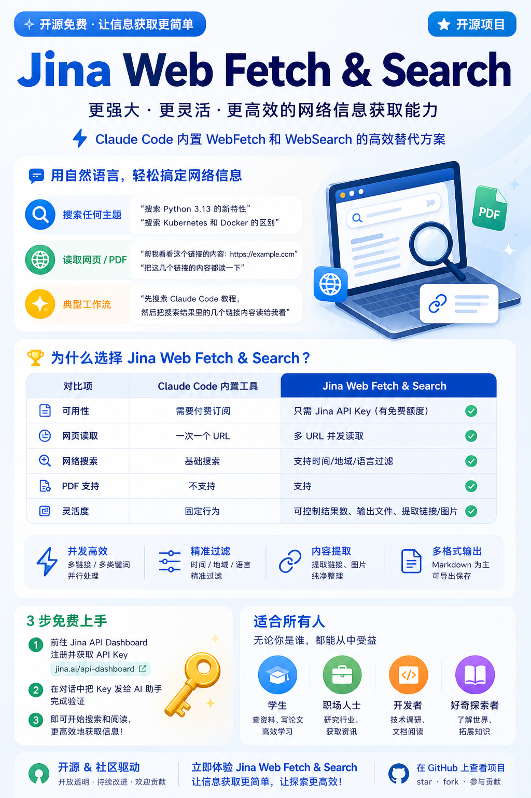

# Jina Web



一个轻量级 Claude Code 自定义 Skill，通过 Jina AI OpenAPI 实现网页内容读取和网络搜索功能。**可作为 Claude Code 内置 WebFetch 和 WebSearch 工具的高效替代方案**，零第三方依赖，支持并发操作。

## 安装

```bash
skills add yungyu16/skills/jina-web
```

## 使用方式

安装后，**在 Claude Code 对话中直接用自然语言描述需求**，agent 会自动调用。

### 搜索

> "搜索 Python 3.13 的新特性"

> "搜索 Kubernetes 和 Docker 的区别"

### 读取网页

> "帮我看看这个链接的内容：https://example.com"

> "把这几个链接的内容都读一下"

### 典型工作流

> "先搜索 Claude Code 教程，然后把搜索结果里的几个链接内容读给我看"

## 为什么要用这个 Skill？

Claude Code 内置的 `WebFetch` 和 `WebSearch` 工具需要付费订阅。如果你没有订阅，或者需要更强大的网络信息获取能力，这个 Skill 是一个高效的替代方案：

| 对比项        | Claude Code 内置工具 | Jina Skill             |
|:-----------|:-----------------|:-----------------------|
| **可用性**    | 需要付费订阅           | 只需 Jina API Key（有免费额度） |
| **网页读取**   | 一次一个 URL         | 多 URL 并发               |
| **网络搜索**   | 基础搜索             | 支持时间/地域/语言过滤           |
| **PDF 支持** | 不支持              | 支持                     |
| **灵活度**    | 固定行为             | 可控制结果数、输出文件、提取链接/图片    |

## 认证

首次使用需要设置 Jina API Key，agent 会引导你完成：

1. 前往 [Jina API Dashboard](https://jina.ai/api-dashboard/) 注册并获取 Key
2. 在对话中把 Key 发给 agent
3. agent 自动验证并保存，后续无需重复

## 注意事项

- **Reader API**（r.jina.ai）免费可用（约 20 次/分钟）
- **Search API**（svip.jina.ai）需要 Jina 官方订阅
